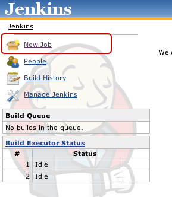

!SLIDE commandline small
# Configuring the jenkins user #
## Installing RVM ##
If you installed jenkins using apt-get, you will already have a
`jenkins` user.

If you plan to use RVM, switch to `jenkins` and install RVM
    $ sudo su - jenkins
    $ bash -s stable < <(curl -s \
    https://raw.github.com/wayneeseguin/rvm/master/binscripts/rvm-installer)

!SLIDE commandline small
# Configuring the jenkins user #
## Creating ssh keys ##
As the `jenkins` user, run the following
    $ ssh-keygen

Add an SSH Public Key to GitHub using the contents of `/var/lib/jenkins/.ssh/id_rsa.pub` 

!SLIDE 
# Configuring the project #
## Setting up the post-receive hook in GitHub ##
Set a Post-Receive URL of your GitHub project to:

    http://<jenkins domain>/github-webhook/

!SLIDE center

!SLIDE center
# Configuring the project #
## Creating a new job ##

!SLIDE center
# Configuring the project #
## Creating a new job ##

